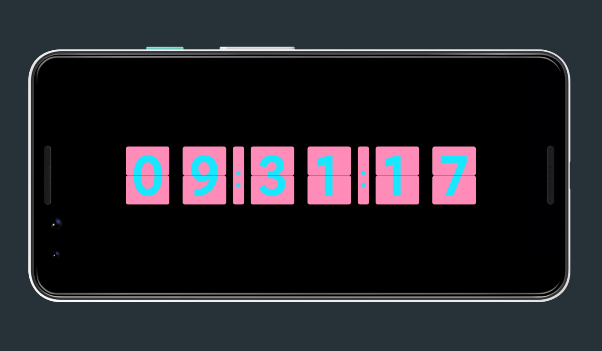

⚠ ***该项目已归档*** 🗃

---

  

## AwesomeClock「翻页时钟」

### 预览

演示机型：***Google Pixel 3***

<table>
    <tr>
        <td>⚙ SETTING</td> 
        <td>🏠 HOME</td> 
   </tr>
    <tr>
        <td rowspan="2"></td>    
        <td ></td>  
    </tr>
    <tr>
        <td ></td>  
    </tr>
</table>

### 介绍

一个简单的翻页时钟 ⏰，让旧手机重获新生 ♻

### 注意事项 ⚠

- 推荐采用 ***AMOLED*** 屏幕的设备使用，更加省电 🔋
- 如果是 ***AMOLED*** 设备，长时间使用此应用可能会出现**烧屏**现象，因此推荐**旧手机**使用

### 特点

- 纯粹的翻页时钟
- 可对时钟的大小、翻页背景色、文字颜色和小时制等进行设置
- 没有任何特殊权限请求

### 下载

### 其它

应用图标来源[iconfont](https://www.iconfont.cn/)，侵删
